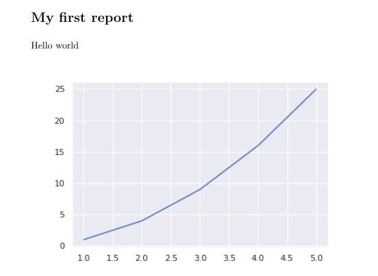

# Paper Dash

The easier way to generate simple static reports from python code.

Integrates well with the libraries that every data scientist is already used to: pandas, matplotlib, etc.


# Installation
Install with pip:

`pip install paperdash`

To generate the PDF reports there are two dependencies that should be installed with apt/zypper/rpm/etc, pandoc and texlive:

`apt install texlive-xetex pandoc`

# Usage example

```python
from paperdash import StaticReport
import matplotlib.pyplot as plt

report = StaticReport()
report.add_text('My first report', style='title1')
report.add_text('Hello world')
plt.plot([1,2,3,4,5], [1,4,9,16,25])
report.add_graph()
report.save('MyFirstReport.pdf')
```
And the output will look like:


# Roadmap

* Support more output formats: HTML, Excel, among others.
* Support styles, themes, and other visual personalizations.
* Make it available as pip package (yep, it is not yet)
